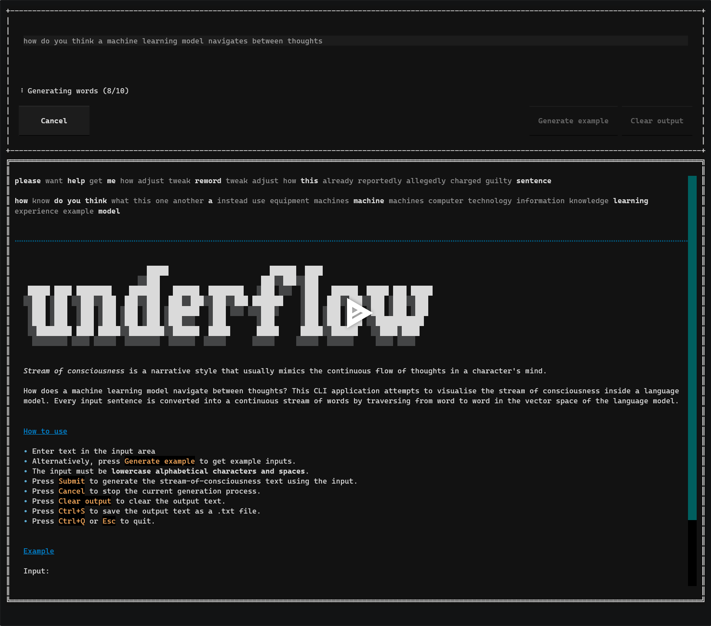

# underflow

A CLI application that converts input sentences into _stream of consciousness_ text using a language model.

<a href="https://asciinema.org/a/Xs9Me3LJbWOZx2eSdF6vxJVkz" target="_blank"></a>

## Requirements

- Python 3.11+
- [`uv`](https://docs.astral.sh/uv/)

## Usage

### Option 1: Without cloning the repository

```bash
uvx -p 3.11 --from git+https://github.com/awoo424/underflow underflow
```

### Option 2: By cloning the repository

```
git clone https://github.com/awoo424/underflow.git
cd underflow
uv run underflow
```

## Development

Static analysis and formatting can be run using `ruff`:

```bash
uv run ruff check src
uv run ruff format src
```

Type checking can be run using `mypy`:

```bash
uv run mypy src
```